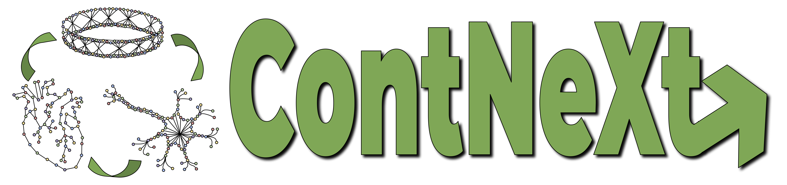
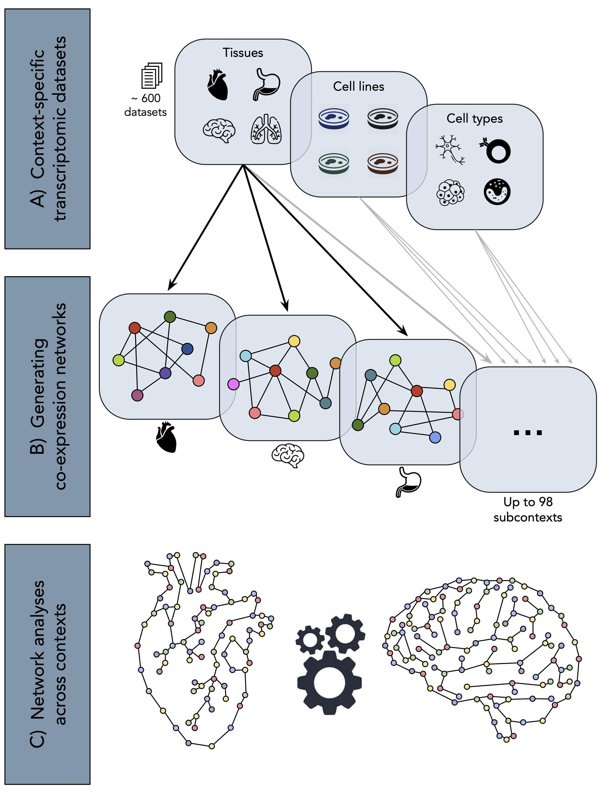
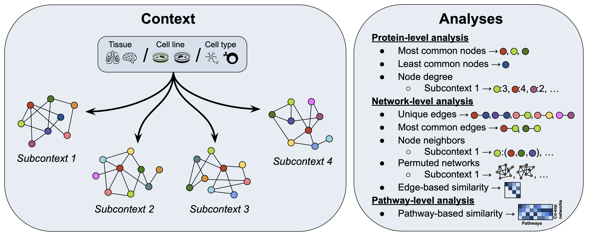

<p align="center">

</p>

## Table of Contents

* [General Info](#general-info)
* [Citation](#citation)
* [Datasets](#datasets)
* [Generating co-expression networks from GEO](#generating-co-expression-networks-from-geo)
* [Analyses](#analyses)
* [Results](#results)

## General Info
This repository contains code and data<sup>[1](#myfootnote1)</sup> described in detail in our paper, "Elucidating gene expression patterns across multiple biological contexts through a large-scale investigation of transcriptomic datasets" (Figueiredo *et al.*, 2021), which aims at revealing common and specific biological processes and mechanisms across contexts by identifying transcriptional patterns that are unique to various cell types, tissues, and cell lines, as well as patterns which are consistent across them. 


<p align="center">
  
</p>

## Citation

If you have found our study useful in your work, please consider citing:

<font color="red"> TODO citation </font>


### Setup environment
Install requirements
```shell script
pip install -r requirements.txt
```

## Datasets
<a name="myfootnote1">1</a>: Datasets can be directly downloaded from  [](https://doi.org/10.5281/zenodo.5831786)

To run the Python/R scripts and Jupyter notebooks the zip file from Zenodo has to be downloaded, with its location path stated as the variable `data_dir` in scripts/notebooks where prompted.
The content is structured as follows:
```
.
├── coexpr_networks 
│   ├── tissue 
│   │   ├── <UBERON ID>
│   │   │   └── coexp_network_edges.tsv
│   │   └── ... x46
│   ├── cell_type
│   │   ├── <CL ID> 
│   │   │   └── coexp_network_edges.tsv
│   │   └── ... x30
│   └── cell_line 
│       ├── <CLO ID> 
│       │   └── coexp_network_edges.tsv
│       └── ... x22
│
├── controllability_analysis
│   ├── interactome_edge_classifications.tsv
│   ├── interactome_indispensable_edges.txt
│   ├── interactome_indispensable_nodes.txt
│   ├── interactome_node_classifications.tsv
│   ├── interactome_summary.tsv
│   ├── interactome.linktype
│   ├── interactome.nodemap
│   ├── interactome.nodetype
│   └── interactome.output
│
├── data_for_coexp_network_construction
│   ├── organism.part 
│   │   ├── <UBERON ID>
│   │   │   ├── datasets.txt
│   │   │   └── metadata.tsv
│   │   └── ... x46
│   ├── cell.type
│   │   ├── <CL ID> 
│   │   │   ├── datasets.txt
│   │   │   └── metadata.tsv
│   │   └── ... x30
│   └── cell.line 
│       ├── <CLO ID> 
│       │   ├── datasets.txt
│       │   └── metadata.tsv
│       └── ... x22
│
├── interactome 
│   ├── interactome_18_01_2021.tsv 
│   └── interactome_edges.tsv 
│
├── mappings 
│   ├── CL_name_mappings.json
│   ├── CLO_name_mappings.json
│   ├── doid_name_mappings.json
│   ├── hgnc_name_mappings.json
│   └── uberon_name_mappings.json
│
├── metadata 
│   ├── final_metadata.tsv
│   ├── gemma_dump_FINAL.tsv
│   ├── gemma_dump_ontologies.tsv
│   ├── metadata_before_curation_shortened.tsv
│   ├── metadata_before_curation.tsv
│   ├── metadata_for_manual_curation_shortened.tsv
│   ├── metadata_for_manual_curation.tsv
│   ├── metadata_manual_curation_version_shortened.tsv
│   ├── metadata_manual_curation_version.tsv
│   ├── metadataFinal_afterDataLoading.RData
│   └── metadataFinal_afterDataLoading.tsv
│
├── misc_data
│   ├── tissue_neighbors.json
│   ├── cell-type_neighbors.json
│   ├── cell-line_neighbors.json
│   ├── tis_100000most_common_edges.json
│   ├── ct_100000most_common_edges.json
│   ├── cl_100000most_common_edges.json
│   ├── tissue_overview.tsv
│   ├── celltype_overview.tsv
│   ├── cellline_overview.tsv
│   ├── FULL_tissue_overview_after_download.tsv
│   ├── FULL_celltype_overview_after_download.tsv
│   ├── FULL_cellline_overview_after_download.tsv
│   ├── FULL_tissue_overview.tsv
│   ├── FULL_celltype_overview.tsv
│   ├── FULL_cellline_overview.tsv
│   ├── pairwise_similarity_tissues.tsv
│   ├── pairwise_similarity_cell_types.tsv
│   ├── pairwise_similarity_cell_lines.tsv
│   └── HK_genes.txt
│
├── node_properties
│   ├── interactome_node_properties.tsv 
│   ├── tissue
│   │   ├── <UBERON ID> 
│   │   │   └── node_properties.tsv
│   │   └── ... x46
│   ├── cell_type  
│   │   ├── <CL ID>  
│   │   │   └── node_properties.tsv
│   │   └── ... x30
│   └──  cell_line
│       ├── <CLO ID> 
│       │   └── node_properties.tsv
│       └── ... x22
│
└── pathway
    ├── gene_pathway_assignment.json
    ├── kegg_hgnc_ids.gmt
    └── kegg_mapping.json
```
## Generating co-expression networks from GEO
Using the preliminary notebooks and R scripts outlined in [/analyses](/analyses) and [/R](/R), respectively, we selected datasets via leveraging the Gemma database belonging to the most widely used platform, 
the Affymetrix Human Genome U133 Plus 2.0 Array (accession on GEO: GPL570) and queried the selected datasets from Gene Expression Omnibus (GEO) and filtered for healthy patient data. 
After manual curation to identify and merge related subcontexts, the WGCNA package in R constructed co-expression networks, and the corresponding edge lists were saved for further analysis with Python.

The resulting edge lists can be seen in the Zenodo page.

To generate this data yourself, the following R scripts and jupyter notebooks have to be run in order:
1. /analyses/0.1-preliminary_stats.ipynb
2. /analyses/0.2-arrange_metadata_for_curation.ipynb 
3. /analyses/0.3-analyze_metadata_overview.ipynb 
4. /analyses/0.4-finalize_metadata.ipynb
5. /analyses/0.5-prep_metadata_for_net_construction.ipynb
6. /R/1_downloadData_GEO.R
7. /R/2_prepDataForWGCNA.R
8. /R/3_getNetworkFromExpData.R

## Analyses
Main portions of the analyses can be seen in the Python scripts in [/analyses](/analyses) and can be reproduced by running the scripts in the following order:
- /analyses/1-networks_overview.py
- /analyses/2-protein-analysis.py
- /analyses/3-pairwise_similarity_co-exp_nets.py
- /analyses/4-interactome_node_overview.py
- /analyses/5-node_neighbors.py
- /analyses/6-random_permutations.py
- /analyses/7-most_common_edges.py
- /analyses/8-pathway_similarity.py

<p align="center">
  
</p>

## Results
Results can be reproduced by running the Python scripts outlined in the section above and summary results as figures can be found in [/figures](/figures)

### Overview of context-specific co-expression networks
[Figure 3](/figures/figure3.png) gives an overview on the number of nodes of each of the co-expression networks.
Here we see how many subcontexts are in each biological context (tissues, cell types, and cell lines) as well as how big the individual networks are. Network size varies greatly, from 6,514 to 20,158 nodes. The three contexts vary in size from 22 to 46 subcontexts.

[Supplementary figure 1](/figures/supp_figure1.png) plots the correlation between number of nodes to number of datasets (left) and number of samples (right) for all subcontexts/networks.
Here we see that neither the number of datasets nor the number of samples used to construct the co-expression networks show any correlation te resulting network size.

### Analyses at the protein-level

Supplementary figures [2](/figures/supp_figure2.png) and [5](/figures/supp_figure5.png) illustrates the similarity of the proteins in the tissue co-expression networks and of the Human interactome network.
Sup. fig. 2: Here we see the overlap between proportional amounts of the most well-connected proteins of the interactome and most common proteins of tissue co-expression networks. The overlap is very minimal: 0-9%
Sup. fig. 5: Here we see the overlap between proportional amounts of the least well-connected proteins of the interactome and least common proteins of tissue co-expression networks. The overlap is more consistantly minimal: 1-8%

Supplementary figures [3](/figures/supp_figure3.png) and [6](/figures/supp_figure6.png) illustrates the similarity of the proteins in the cell type co-expression networks and of the Human interactome network.
Sup. fig. 2: Here we see the overlap between proportional amounts of the most well-connected proteins of the interactome and most common proteins of cell type co-expression networks. The overlap is more substantial: 2-33%
Sup. fig. 5: Here we see the overlap between proportional amounts of the least well-connected proteins of the interactome and least common proteins of cell type co-expression networks. The overlap is consistantly minimal: 1-8%


Supplementary figures [4](/figures/supp_figure4.png) and [7](/figures/supp_figure7.png) illustrates the similarity of the proteins in the cell line co-expression networks and of the Human interactome network.
Sup. fig. 2: Here we see the overlap between proportional amounts of the most well-connected proteins of the interactome and most common proteins of cell line co-expression networks. The overlap is substantial: 2-40%
Sup. fig. 5: Here we see the overlap between proportional amounts of the least well-connected proteins of the interactome and least common proteins of cell line co-expression networks. The overlap is minimal: 1-9%

### Analyses at the network-level
[Figure 4](/figures/figure4.png) represents the frequency of edge occurence across networks within a context.
Here we see that between 49-71% of all edges within a context are entirely unique, whereas only ~0.1% are edges common to at least 25% of the networks in the context. Additionally, of this 0.1%, only ~1-2% of those are further more common to at least 50% of networks in the context. Lastly, ~1-2% of these edges are most common (i.e., common to at least 75% of networks in a context).

[Figure 5](/figures/figure5.png) shows the pairwise similarity of co-expression networks in a given context.
Here we see that overall, only very few networks have high degree of similarity to another network in each context.

### Analyses at the pathway-level
[Figure 6](/figures/figure6.png) shows the mapping of tissue-specific expression patterns with pathway knowledge via network similarity.
Here we see patterns of groups of pathways being especially expressed in certain tissues.

[Supplementary figure 8](/figures/supp_figure8.png) shows the mapping of cell type-specific expression patterns with pathway knowledge via network similarity.
Here we see patterns of groups of pathways being especially expressed in certain cell types.

[Supplementary figure 9](/figures/supp_figure9.png) shows the mapping of cell line-specific expression patterns with pathway knowledge via network similarity.
Here we see patterns of groups of pathways being especially expressed in certain cell lines.